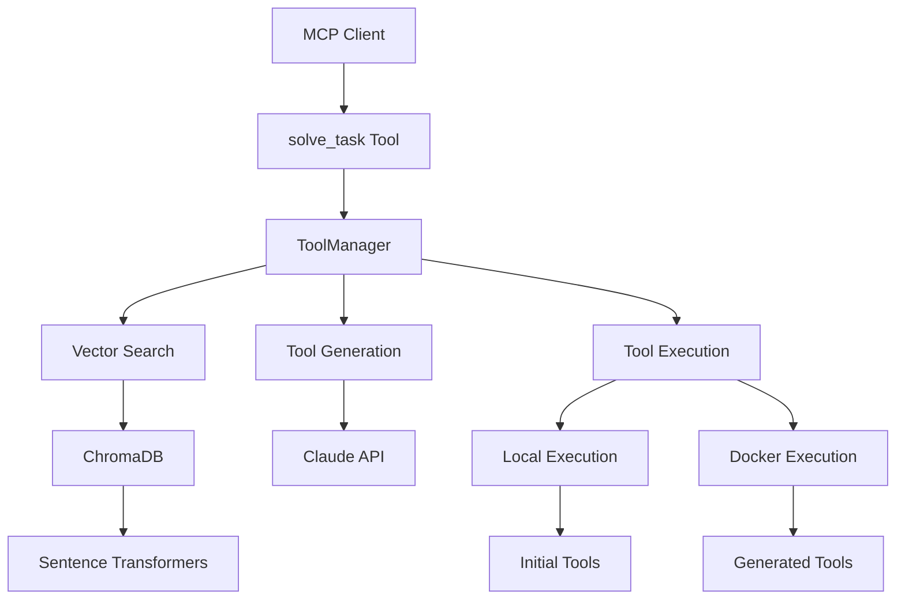

# Tool Smith MCP - Comprehensive Documentation

A **Model Context Protocol (MCP) server** that dynamically creates and manages tools using LLM assistance with optional containerization for secure execution.

## Table of Contents

- [Overview](#overview)
- [Architecture](#architecture)
- [Implementation Details](#implementation-details)
- [Optional Containerization](#optional-containerization)
- [Control Flow](#control-flow)
- [Configuration](#configuration)
- [API Reference](#api-reference)
- [Development](#development)
- [Deployment](#deployment)

## Overview

Tool Smith MCP is an intelligent tool management system that bridges the gap between static, predefined tools and dynamic, context-aware functionality. It operates on a **two-layer architecture** where a top-level MCP tool (`solve_task`) orchestrates the execution of second-layer Python functions that can be either initial (built-in) or runtime-generated.

### Core Philosophy

1. **Semantic Tool Discovery**: Instead of manually selecting tools, describe what you want to accomplish
2. **Dynamic Tool Creation**: If no suitable tool exists, the system generates one using Claude API
3. **Persistent Tool Evolution**: Generated tools are saved and can be reused for similar tasks
4. **Security-First Design**: Generated tools execute in isolated environments with strict resource limits
5. **Performance Optimization**: Multi-level caching eliminates redundant computations

## Architecture

### System Overview



### Two-Layer Tool System

#### Layer 1: MCP Tool Interface
- **`solve_task`**: The primary interface that receives task descriptions and coordinates execution
- **Input Processing**: Validates parameters and structures the request
- **Output Formatting**: Ensures responses conform to MCP protocol

#### Layer 2: Python Function Execution
- **Initial Tools**: Pre-built, trusted functions providing fundamental operations
- **Generated Tools**: Dynamically created functions that extend capabilities
- **Execution Environment**: Local or Docker-based execution depending on tool type

### Core Components

#### ToolManager
The central orchestrator that manages the entire tool lifecycle:

**Responsibilities:**
- **Tool Discovery**: Searches existing tools using semantic similarity
- **Tool Creation**: Generates new tools when existing ones are insufficient  
- **Tool Execution**: Safely executes tools in appropriate environments
- **Tool Persistence**: Saves and indexes new tools for future use

**Key Methods:**
- `solve_task()`: Main entry point for task resolution
- `_execute_tool_safely()`: Handles secure tool execution with optional containerization
- `execute_tool_directly()`: Direct tool execution for testing and debugging
- `list_tools()`: Returns structured information about available tools

#### VectorStore
Provides semantic search capabilities using embeddings:

**Technology Stack:**
- **ChromaDB**: Vector database for similarity search
- **Sentence Transformers**: Text embedding generation (all-MiniLM-L6-v2)
- **Persistent Storage**: Maintains tool index across server restarts

**Process:**
1. Tool descriptions are converted to embeddings during indexing
2. Task descriptions are embedded for similarity comparison
3. Cosine similarity determines the best matching tools
4. Configurable threshold controls when to reuse vs generate

#### ClaudeClient
Handles all interactions with the Claude API:

**Functions:**
- **Tool Generation**: Creates new Python functions based on task descriptions
- **Argument Structuring**: Maps available arguments to function parameters
- **Code Validation**: Ensures generated code meets quality standards

**Configuration Parameters:**
- Model selection (claude-3-5-sonnet-20241022)
- Temperature control for deterministic vs creative generation
- Token limits for response size management

#### DockerExecutor
Provides secure execution environment for generated tools:

**Security Features:**
- **Network Isolation**: Containers have no network access
- **Read-only Filesystem**: Prevents file system modifications
- **Resource Limits**: Configurable memory and CPU constraints
- **Timeout Enforcement**: Prevents infinite execution
- **Automatic Cleanup**: Containers are removed after execution

**Implementation Details:**
- Uses official Python Docker images
- Mounts tool dependencies as read-only volumes
- Captures stdout/stderr for result extraction
- Handles execution errors with proper exception mapping

## Implementation Details

### Pydantic Models

The system uses Pydantic models to ensure type safety and data validation:

#### ToolInfo Model
```python
class ToolType(str, Enum):
    INITIAL = "initial"
    GENERATED = "generated" 
    UNKNOWN = "unknown"

class ToolInfo(BaseModel):
    name: str = Field(..., description="Name of the tool")
    signature: str = Field(..., description="Function signature")
    docstring: str = Field(..., description="Tool documentation")
    type: ToolType = Field(..., description="Type of tool")
    file: str = Field(..., description="Path to the tool file")
```

This replaces dictionary returns with structured, validated data objects that provide:
- **Type Safety**: Compile-time verification of data structure
- **Validation**: Automatic validation of field types and constraints
- **Documentation**: Self-documenting API with clear field descriptions
- **IDE Support**: Better autocomplete and error detection

#### SearchResult Model
```python
class SearchResult(BaseModel):
    tool_id: str = Field(..., description="Unique identifier of the tool")
    similarity_score: float = Field(..., description="Similarity score (0.0-1.0)")
    content: str = Field(..., description="Tool description/content")
    metadata: Dict[str, Any] = Field(default_factory=dict, description="Additional metadata")
```

### Tool Storage and Metadata

#### Storage Strategy
- **Initial Tools**: Stored in `resources/initial_tools/` as part of the package
- **Generated Tools**: Stored in configurable `tools_dir` (default: `./tool-smith-mcp/tools/`)
- **Vector Index**: ChromaDB database maintains semantic search index
- **Metadata Tracking**: JSON-based metadata for each tool including source, type, and creation time

#### Tool Loading Process
1. **Initialization**: Load initial tools from package resources
2. **Discovery**: Scan tools directory for previously generated tools
3. **Indexing**: Add all tool descriptions to vector database
4. **Validation**: Verify tool integrity and accessibility

### Caching System

#### Multi-Level Caching Architecture
1. **Embedding Cache**: Caches text embeddings to avoid recomputation
2. **Tool Code Cache**: Caches generated tool code for similar tasks
3. **File-Based Persistence**: Cache survives server restarts
4. **TTL Management**: Configurable time-to-live for different data types

#### Performance Impact
- **Embedding Generation**: Up to 90% faster for repeated queries
- **Tool Discovery**: Instant retrieval of cached similarity scores
- **Memory Efficiency**: File-based cache doesn't consume server memory

## Optional Containerization

### Design Philosophy

Tool Smith MCP implements **universal containerization** with a **fail-fast approach**:

- **ALL Tools**: Execute in Docker containers by default for security and consistency
- **Initial Tools**: Execute in containers like generated tools (consistent environment)
- **Generated Tools**: Execute in Docker containers (untrusted code isolation)
- **Force Local Option**: Available for debugging and development only
- **No Fallback**: If Docker is enabled but fails, the operation fails (no silent degradation)

### Configuration Options

```toml
[docker]
enabled = true                     # Enable/disable Docker execution for ALL tools
force_local_for_debugging = false # Force all tools to execute locally (debugging only)
image_name = "python:3.10-slim"   # Container image matching venv Python version
container_timeout = 30            # Maximum execution time
memory_limit = "256m"             # Memory constraint
cpu_limit = 0.5                   # CPU constraint (fraction of core)
```

### Execution Decision Matrix

| Tool Type | Docker Enabled | Force Local | Execution Environment |
|-----------|----------------|-------------|----------------------|
| Initial   | True          | False       | Docker Container     |
| Initial   | True          | True        | Local (debug mode)   |
| Initial   | False         | Any         | Local                |
| Generated | True          | False       | Docker Container     |
| Generated | True          | True        | Local (debug mode)   |
| Generated | False         | Any         | Local                |

### Why No Fallback?

The system explicitly **does not fall back** to local execution when Docker fails because:

1. **Security Guarantees**: Users who enable Docker expect containerized execution for generated tools
2. **Predictable Behavior**: Silent fallbacks can mask configuration issues
3. **Fail Fast Principle**: Immediate feedback about Docker problems enables quick resolution
4. **Clear Error Messages**: Detailed error information helps diagnose Docker issues

### Docker Execution Process

1. **Container Creation**: 
   - Uses specified Python image
   - Mounts tool dependencies as read-only volumes
   - Applies resource limits (memory, CPU)
   - Disables network access

2. **Code Execution**:
   - Generates execution script with tool code
   - Executes function with provided arguments
   - Captures result as JSON output

3. **Result Processing**:
   - Parses JSON output from container
   - Maps container exceptions to Python exceptions
   - Returns structured result or raises appropriate error

4. **Cleanup**:
   - Automatically removes container
   - Cleans up temporary files
   - Logs execution metrics

## Control Flow

### Complete Request Processing Flow

```mermaid
graph TD
    A[MCP Client Request] --> B[Parameter Validation]
    B --> C{Valid Parameters?}
    C -->|No| D[Return Error]
    C -->|Yes| E[Semantic Search]
    
    E --> F[Generate Task Embedding]
    F --> G[Search Vector Database]
    G --> H{Similar Tool Found?}
    
    H -->|Yes| I[Load Existing Tool]
    H -->|No| J[Generate New Tool]
    
    I --> K{Tool Loadable?}
    K -->|No| J
    K -->|Yes| L[Structure Arguments]
    
    J --> M[Call Claude API]
    M --> N{Generation Success?}
    N -->|No| O[Return Generation Error]
    N -->|Yes| P[Validate Generated Code]
    P --> Q{Code Valid?}
    Q -->|No| O
    Q -->|Yes| R[Save Tool to Filesystem]
    R --> S[Index in Vector Database]
    S --> L
    
    L --> T{Docker Enabled?}
    T -->|No| U[Execute Locally]
    T -->|Yes| V{Force Local?}
    V -->|Yes| U
    V -->|No| X[Execute in Docker (ALL tools)]
    
    U --> Y[Capture Result]
    X --> Z{Docker Success?}
    Z -->|No| AA[Return Docker Error]
    Z -->|Yes| Y
    
    Y --> BB[Format Response]
    BB --> CC[Return to Client]
```

### Decision Points and Their Implications

#### Similarity Threshold Decision
- **High Threshold (0.8-1.0)**: More tool generation, fewer reused tools, higher accuracy
- **Low Threshold (0.3-0.6)**: More tool reuse, faster responses, potentially less accurate matches

#### Tool Generation Decision
Triggered when:
- No existing tools found above similarity threshold
- Existing tool fails to load or execute
- Arguments cannot be properly structured for existing tool

#### Execution Environment Decision
Based on:
- Tool type (initial vs generated)
- Docker availability and configuration
- Debug mode settings
- Security requirements

### Error Handling Strategy

#### Fail-Fast Approach
- **Configuration Errors**: Immediate failure with detailed error message
- **Docker Unavailable**: Clear error when Docker is expected but unavailable
- **Claude API Issues**: Specific error codes and retry guidance
- **Tool Execution Failures**: Detailed exception information

#### Error Categories
1. **Input Validation Errors**: Invalid parameters, missing required fields
2. **Configuration Errors**: Missing API keys, invalid settings
3. **Tool Discovery Errors**: Vector database issues, embedding failures
4. **Tool Generation Errors**: Claude API failures, invalid generated code
5. **Execution Errors**: Runtime failures, timeouts, resource constraints

## Configuration

### Complete Configuration Reference

```toml
[server]
name = "tool-smith-mcp"
version = "0.1.0"
description = "MCP server that dynamically creates and manages tools using LLM assistance"

[claude]
# Claude API configuration
model = "claude-3-5-sonnet-20241022"
max_tokens = 4000
temperature = 0.1
structure_args_temperature = 0.0
structure_args_max_tokens = 1000

[tools]
# Tool discovery and creation settings
similarity_threshold = 0.7  # Minimum similarity score for tool reuse (0.0-1.0)
search_top_k = 3           # Number of similar tools to search for
tools_dir = "./tool-smith-mcp/tools"              # Directory for runtime-generated tools
initial_tools_dir = "resources/initial_tools"      # Directory for built-in tools

[vector_store]
# Vector database configuration for semantic search
db_path = "./tool-smith-mcp/vector_db"
collection_name = "tool_descriptions"
model_name = "all-MiniLM-L6-v2"   # Sentence transformer model for embeddings
anonymized_telemetry = false

[docker]
# Docker sandboxing configuration - ALL tools execute in containers
enabled = true                     # Enable/disable Docker execution for ALL tools (initial and generated)
force_local_for_debugging = false # Force local execution for all tools (overrides enabled, useful for debugging)
image_name = "python:3.10-slim"   # Docker image matching venv Python version (3.10)
container_timeout = 30            # Maximum execution time in seconds
memory_limit = "256m"             # Memory limit for containers
cpu_limit = 0.5                   # CPU limit as fraction of single core

[cache]
# Caching configuration for performance optimization
enabled = true                              # Enable/disable caching
cache_dir = "./tool-smith-mcp/cache"       # Directory for cache files
embedding_ttl = 3600                       # Embedding cache TTL in seconds (1 hour)
tool_code_ttl = 1800                       # Tool code cache TTL in seconds (30 minutes)
cleanup_interval = 3600                    # Cache cleanup interval in seconds (1 hour)

[logging]
# Logging configuration
level = "INFO"                             # Log level: DEBUG, INFO, WARNING, ERROR
format = "%(asctime)s - %(name)s - %(levelname)s - %(message)s"

[development]
# Development-specific settings
auto_reload = false                        # Auto-reload on code changes
debug_mode = false                         # Enable debug features
```

### Configuration Impact on Behavior

#### Security Configuration
- **Docker Enabled**: Generated tools execute in isolated containers
- **Docker Disabled**: All tools execute locally (development mode)
- **Force Local**: Overrides Docker for debugging purposes

#### Performance Configuration
- **Similarity Threshold**: Controls tool reuse vs generation balance
- **Cache Settings**: Optimizes response times through intelligent caching
- **Resource Limits**: Prevents resource exhaustion in containerized execution

#### Development Configuration
- **Debug Mode**: Enables additional logging and validation
- **Auto Reload**: Automatically reloads tools when files change
- **Log Level**: Controls verbosity of system logging

## API Reference

### Main Tool: `solve_task`

The primary interface for task resolution.

**Parameters:**
- `task_description` (string, required): Clear description of what needs to be accomplished
- `arguments` (object, optional): Key-value pairs of data needed for the task
- `expected_outcome` (string, optional): Description of expected result format

**Returns:**
- Task execution result (format varies based on task)
- Execution metadata (tool used, execution time, etc.)

**Example Usage:**

```json
{
  "tool": "solve_task",
  "arguments": {
    "task_description": "Calculate compound interest for a loan",
    "arguments": {
      "principal": 10000,
      "annual_rate": 0.05,
      "compound_frequency": 4,
      "years": 3
    },
    "expected_outcome": "final amount after compound interest"
  }
}
```

### ToolManager Methods

#### `list_tools() -> List[ToolInfo]`
Returns structured information about all available tools.

**Returns:**
- List of `ToolInfo` objects with tool metadata

**Example Response:**
```python
[
    ToolInfo(
        name="calculate_math",
        signature="(expression: str) -> float",
        docstring="Evaluate mathematical expressions safely",
        type=ToolType.INITIAL,
        file="resources/initial_tools/calculate_math.py"
    ),
    ToolInfo(
        name="compound_interest_calculator",
        signature="(principal: float, rate: float, time: int, frequency: int) -> float",
        docstring="Calculate compound interest",
        type=ToolType.GENERATED,
        file="./tool-smith-mcp/tools/compound_interest_calculator.py"
    )
]
```

#### `execute_tool_directly(tool_name: str, arguments: Dict[str, Any], force_local: bool = False) -> Any`
Execute a specific tool directly (useful for testing).

**Parameters:**
- `tool_name`: Name of the tool to execute
- `arguments`: Arguments to pass to the tool
- `force_local`: Force local execution even for generated tools

## Development

### Development Setup

```bash
# Clone repository
git clone https://github.com/your-org/tool-smith-mcp.git
cd tool-smith-mcp

# Install with development dependencies
pip install -e ".[dev]"

# Set up environment
export CLAUDE_API_KEY="your_api_key_here"

# Run development server
tool-smith-mcp
```

### Code Quality Standards

#### Formatting and Linting
```bash
# Format code
black src/tool_smith_mcp tests
isort src/tool_smith_mcp tests

# Type checking
mypy src/tool_smith_mcp

# Linting
ruff check src/tool_smith_mcp tests

# Run all quality checks
black src/tool_smith_mcp tests && isort src/tool_smith_mcp tests && mypy src/tool_smith_mcp && ruff check src/tool_smith_mcp tests && pytest
```

#### Testing
```bash
# Run all tests
pytest

# Run with coverage
pytest --cov=tool_smith_mcp --cov-report=term-missing

# Run specific test categories
pytest tests/test_simple_second_layer.py  # Second-layer tool tests
pytest tests/test_containerized_execution.py  # Docker execution tests
```

### Project Structure

```
src/
└── tool_smith_mcp/
    ├── models/                    # Pydantic models for type safety
    │   ├── __init__.py
    │   ├── tool_info.py          # Tool information models
    │   └── search_result.py      # Search result models
    ├── core/
    │   ├── server.py             # Main MCP server implementation
    │   └── tool_manager.py       # Tool creation and management with optional containerization
    ├── utils/
    │   ├── vector_store.py       # Vector database for tool indexing
    │   ├── claude_client.py      # Claude API client
    │   ├── config.py             # Configuration management
    │   ├── cache.py              # Performance caching utilities
    │   └── docker_executor.py    # Docker sandboxing execution
    └── __init__.py

resources/
└── initial_tools/                # Built-in initial tools
    ├── ask_ai.py                # AI question answering with structured output
    ├── calculate_math.py        # Mathematical calculations
    ├── data_processing.py       # Data manipulation and analysis
    ├── datetime_utils.py        # Date and time operations
    ├── encoding_utils.py        # Encoding, hashing, cryptography
    ├── file_operations.py       # File and directory management
    ├── format_text.py           # Text formatting and manipulation
    ├── html_parser.py           # HTML parsing and extraction
    ├── network_utils.py         # HTTP requests and URL handling
    ├── statistics.py            # Statistical calculations
    └── web_fetch.py             # Simple web content fetching

tests/                           # Comprehensive test suite
├── test_server.py              # Server integration tests
├── test_tool_manager.py        # Tool manager unit tests
├── test_simple_second_layer.py # Second-layer tool functionality tests
├── test_containerized_execution.py # Docker execution tests
├── test_vector_store.py        # Vector store tests
├── test_claude_client.py       # Claude API client tests
├── test_config.py              # Configuration tests
├── test_cache.py               # Cache functionality tests
└── test_integration.py         # End-to-end integration tests
```

### Initial Tools Reference

The system includes comprehensive initial tools providing fundamental operations:

#### AI & LLM Operations
- **`ask_ai`**: AI question answering with structured output support using Claude API

#### Mathematical Operations
- **`calculate_math`**: Safe evaluation of mathematical expressions
- **`statistics`**: Statistical calculations (mean, median, standard deviation)

#### Text Processing
- **`format_text`**: String manipulation and formatting operations

#### Web Operations
- **`web_fetch`**: Simple web content fetching
- **`html_parser`**: HTML parsing and data extraction
- **`network_utils`**: HTTP requests and URL handling

#### File Operations
- **`file_operations`**: File and directory management with JSON handling

#### Data Processing
- **`data_processing`**: Data manipulation, filtering, sorting, and aggregation

#### Date & Time
- **`datetime_utils`**: Date and time operations with timezone support

#### Encoding & Security
- **`encoding_utils`**: Encoding, hashing, and cryptographic operations

## Deployment

### Production Deployment Considerations

#### Docker Requirements
- Docker daemon must be running on the host system
- User account must have Docker permissions
- `python:3.10-slim` image will be automatically pulled on first use

#### Resource Planning
- **Memory**: 256MB per concurrent tool execution (Docker containers)
- **CPU**: 50% of one core per execution maximum
- **Disk**: Cache directory for embeddings and tool code storage
- **Network**: Claude API access required for tool generation

#### Security Considerations
- **API Key Management**: Secure storage and rotation of Claude API keys
- **Container Security**: Regular updates of Docker base images
- **Network Security**: Firewall rules for API access
- **File Permissions**: Appropriate permissions for tool directories

#### Monitoring and Observability

**Key Metrics:**
- Tool reuse rate (percentage of requests using existing tools)
- Generation success rate (percentage of successful tool generations)
- Execution time distribution (performance monitoring)
- Error rates by category (reliability monitoring)
- Cache hit rates (performance optimization)

**Logging Configuration:**
```toml
[logging]
level = "INFO"                    # Production: INFO, Development: DEBUG
format = "%(asctime)s - %(name)s - %(levelname)s - %(message)s"
```

**Health Checks:**
- Docker daemon connectivity
- Claude API availability
- Vector database accessibility
- Cache directory writability

### Environment Variables

Required:
- `CLAUDE_API_KEY`: Anthropic Claude API key

Optional:
- `DOCKER_HOST`: Docker daemon connection (for remote Docker)
- `TOOL_SMITH_CONFIG`: Path to configuration file (default: tool-smith.toml)

### Container Deployment

If deploying Tool Smith MCP itself in a container:

```dockerfile
FROM python:3.10-slim

# Install Docker CLI for container-in-container execution
RUN apt-get update && apt-get install -y docker.io

# Install Tool Smith MCP
COPY . /app
WORKDIR /app
RUN pip install -e .

# Mount Docker socket for container execution
VOLUME ["/var/run/docker.sock"]

CMD ["tool-smith-mcp"]
```

This comprehensive documentation provides a complete understanding of Tool Smith MCP's architecture, implementation, and deployment considerations. The system represents a sophisticated approach to dynamic tool management with strong security guarantees through optional containerization and excellent performance through intelligent caching.