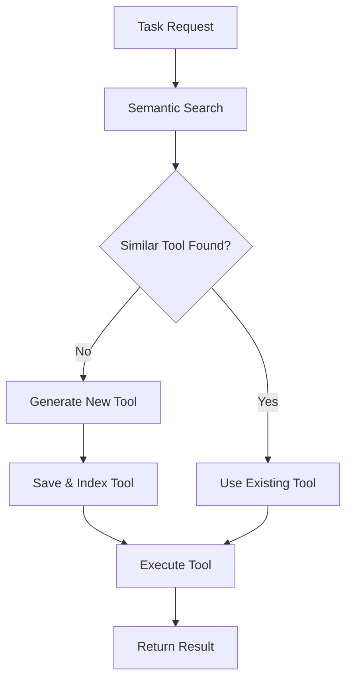

# Tool Smith MCP

A **Model Context Protocol (MCP) server** that dynamically creates and manages tools using LLM assistance. Tool Smith MCP provides intelligent tool creation, semantic search, and persistent tool management for enhanced AI capabilities.

## 🚀 Features

### Core Capabilities
- **Dynamic Tool Creation**: Automatically generates new tools using Claude API when existing tools don't match requirements
- **Semantic Tool Search**: Uses vector embeddings to find the most suitable existing tools for tasks
- **Persistent Tool Storage**: Saves generated tools for reuse and builds a growing toolkit over time
- **Rich Initial Tools**: Comprehensive set of building-block tools for common operations

### 🔒 Security & Isolation
- **Docker Sandboxing**: Generated tools execute in isolated Docker containers with strict resource limits
- **Network Isolation**: Containers have no network access to prevent data exfiltration
- **Resource Constraints**: Memory (256MB) and CPU (50%) limits prevent resource exhaustion
- **Automatic Cleanup**: Containers are automatically removed after execution

### ⚡ Performance & Efficiency
- **Intelligent Caching**: Multi-level caching for embeddings, tool code, and execution results
- **Embedding Cache**: Prevents re-computation of identical text embeddings (1-hour TTL)
- **Tool Code Cache**: Caches generated tool code for similar tasks (30-minute TTL)
- **Persistent Cache**: File-based cache survives server restarts

### 🛡️ Reliability & Monitoring
- **Robust Error Handling**: Fail-fast approach with detailed error messages and graceful degradation
- **Comprehensive Logging**: Structured logging with configurable verbosity levels
- **Health Monitoring**: Docker connectivity and API availability checks
- **Type Safety**: Full type hints and Pydantic validation throughout

### ⚙️ Configuration & Deployment
- **TOML Configuration**: Comprehensive configuration with environment variable support
- **Flexible Deployment**: Docker-optional deployment with automatic fallback
- **Development Tools**: Complete testing suite and code quality checks

## 📋 Table of Contents

- [Installation](#installation)
- [Quick Start](#quick-start)
- [Configuration](#configuration)
- [Architecture](#architecture)
- [Initial Tools](#initial-tools)
- [Development](#development)
- [API Reference](#api-reference)
- [Examples](#examples)
- [Contributing](#contributing)

## 🛠 Installation

### Prerequisites

- Python 3.10 or higher
- Claude API key from Anthropic

### Install from PyPI (when available)

```bash
pip install tool-smith-mcp
```

### Install from Source

```bash
git clone https://github.com/your-org/tool-smith-mcp.git
cd tool-smith-mcp
pip install -e ".[dev]"
```

## ⚡ Quick Start

### 1. Set up your Claude API key

```bash
export CLAUDE_API_KEY="your_claude_api_key_here"
```

### 2. Run the MCP server

```bash
tool-smith-mcp
```

### 3. Connect from your MCP client

The server provides a single `solve_task` tool that can handle any request by either using existing tools or creating new ones.

**Example usage:**

```json
{
  "tool": "solve_task",
  "arguments": {
    "task_description": "Calculate the area of a circle with radius 5",
    "arguments": {"radius": 5},
    "expected_outcome": "numerical result"
  }
}
```

## ⚙️ Configuration

Tool Smith MCP uses a `tool-smith.toml` configuration file. Create one in your working directory:

```toml
[server]
name = "tool-smith-mcp"
version = "0.1.0"

[claude]
model = "claude-3-5-sonnet-20241022"
max_tokens = 4000
temperature = 0.1

[tools]
similarity_threshold = 0.7
search_top_k = 3
tools_dir = "./tool-smith-mcp/tools"
initial_tools_dir = "resources/initial_tools"

[vector_store]
db_path = "./tool-smith-mcp/vector_db"
model_name = "all-MiniLM-L6-v2"

[docker]
enabled = true
image_name = "python:3.11-slim"
container_timeout = 30
memory_limit = "256m"
cpu_limit = 0.5

[cache]
enabled = true
cache_dir = "./tool-smith-mcp/cache"
embedding_ttl = 3600      # 1 hour
tool_code_ttl = 1800      # 30 minutes

[logging]
level = "INFO"
format = "%(asctime)s - %(name)s - %(levelname)s - %(message)s"
```

### Configuration Sections

- **server**: Basic server settings (name, version)
- **claude**: Claude API configuration (model, tokens, temperature)
- **tools**: Tool management settings (similarity threshold, directories)
- **vector_store**: Vector database configuration for semantic search
- **docker**: Docker sandboxing configuration (image, limits, timeout)
- **cache**: Performance caching settings (TTL, directories)
- **logging**: Logging level and format configuration

### Security Configuration

**Docker Sandboxing** (recommended for production):
```toml
[docker]
enabled = true                    # Enable Docker isolation
image_name = "python:3.11-slim"  # Container image
container_timeout = 30           # Max execution time (seconds)
memory_limit = "256m"            # Memory limit
cpu_limit = 0.5                  # CPU limit (fraction of core)
```

**Performance Optimization**:
```toml
[cache]
enabled = true                   # Enable caching
cache_dir = "./tool-smith-mcp/cache"
embedding_ttl = 3600            # Embedding cache TTL (1 hour)
tool_code_ttl = 1800            # Tool code cache TTL (30 minutes)
```

### Environment Variables

- **CLAUDE_API_KEY**: Required. Your Anthropic Claude API key
- **DOCKER_HOST**: Optional. Docker daemon connection (if using remote Docker)

## 🏗 Architecture

Tool Smith MCP uses a **two-layer tool system**:

### Layer 1: MCP Tool
- **`solve_task`**: The main interface that receives task descriptions and coordinates tool execution

### Layer 2: Python Functions
- **Initial Tools**: Built-in tools providing fundamental operations
- **Generated Tools**: Dynamically created tools that build upon initial tools

### Core Components

- **ToolManager**: Orchestrates tool discovery, creation, and execution
- **VectorStore**: Provides semantic search over tool descriptions using ChromaDB
- **ClaudeClient**: Handles LLM interactions for tool generation and argument structuring
- **Config System**: Manages all configurable aspects of the system

### Tool Creation Flow



## 🔧 Initial Tools

Tool Smith MCP comes with a comprehensive set of **initial tools** that serve as building blocks:

### AI & LLM Operations
- **`ask_ai`**: AI question answering with structured output support
- Uses Claude API with tool calling for reliable JSON responses

### Mathematical Operations
- **`calculate_math`**: Safe evaluation of mathematical expressions
- **`statistics`**: Statistical calculations (mean, median, std, summary)

### Text Processing  
- **`format_text`**: String manipulation and formatting
- Case conversion, trimming, replacement, validation

### Web Operations
- **`web_fetch`**: Simple web content fetching
- **`html_parser`**: HTML parsing and data extraction
- **`network_utils`**: HTTP requests and URL handling

### File Operations
- **`file_operations`**: File and directory management
- Read, write, list, create, delete files and directories
- JSON handling, path operations

### Data Processing
- **`data_processing`**: Data manipulation and analysis
- Filter, sort, group, transform, aggregate data
- JSON/CSV parsing and formatting

### Date & Time
- **`datetime_utils`**: Date and time operations
- Parsing, formatting, arithmetic, timezone handling
- Age calculation, weekday detection

### Encoding & Security
- **`encoding_utils`**: Encoding, hashing, and cryptographic operations
- Base64/hex encoding, SHA/MD5 hashing
- HMAC, UUID generation, secure random values

## 💻 Development

### Setup Development Environment

```bash
git clone https://github.com/your-org/tool-smith-mcp.git
cd tool-smith-mcp
pip install -e ".[dev]"
```

### Code Quality Commands

```bash
# Format code
black src/tool_smith_mcp tests
isort src/tool_smith_mcp tests

# Type checking
mypy src/tool_smith_mcp

# Linting
ruff check src/tool_smith_mcp tests

# Run tests
pytest

# Run tests with coverage
pytest --cov=tool_smith_mcp --cov-report=term-missing

# Run all quality checks
black src/tool_smith_mcp tests && isort src/tool_smith_mcp tests && mypy src/tool_smith_mcp && ruff check src/tool_smith_mcp tests && pytest
```

### Project Structure

```
src/
└── tool_smith_mcp/
    ├── core/
    │   ├── server.py          # Main MCP server implementation
    │   └── tool_manager.py    # Tool creation and management
    ├── utils/
    │   ├── vector_store.py    # Vector database for tool indexing
    │   ├── claude_client.py   # Claude API client
    │   ├── config.py          # Configuration management
    │   ├── cache.py           # Caching utilities
    │   └── docker_executor.py # Docker sandboxing execution
    └── __init__.py

resources/
└── initial_tools/             # Built-in initial tools
    ├── ask_ai.py              # AI question answering with structured output
    ├── calculate_math.py      # Mathematical calculations
    ├── data_processing.py     # Data manipulation and analysis
    ├── datetime_utils.py      # Date and time operations
    ├── encoding_utils.py      # Encoding, hashing, cryptography
    ├── file_operations.py     # File and directory management
    ├── format_text.py         # Text formatting and manipulation
    ├── html_parser.py         # HTML parsing and extraction
    ├── network_utils.py       # HTTP requests and URL handling
    ├── statistics.py          # Statistical calculations
    └── web_fetch.py           # Simple web content fetching

tests/                         # Comprehensive test suite
├── test_server.py            # Server integration tests
├── test_tool_manager.py      # Tool manager unit tests
├── test_vector_store.py      # Vector store tests
├── test_claude_client.py     # Claude API client tests
├── test_config.py           # Configuration tests
├── test_cache.py            # Cache functionality tests
├── test_docker_executor.py  # Docker execution tests
└── test_integration.py      # End-to-end integration tests

tool-smith.toml              # Configuration file
IMPROVEMENTS.md              # Security and performance improvements
```

## 📚 API Reference

### Main Tool: `solve_task`

Solves tasks using existing tools or by creating new ones.

**Parameters:**
- `task_description` (string, required): Formal description of the task
- `arguments` (object, optional): Arguments required for the task
- `expected_outcome` (string, optional): Expected outcome or return type

**Returns:**
- Task execution result (varies by task)

**Example:**
```json
{
  "task_description": "Convert timestamp 1640995200 to human readable date",
  "arguments": {"timestamp": 1640995200},
  "expected_outcome": "formatted date string"
}
```

## 🎯 Examples

### Example 1: Mathematical Calculation
```json
{
  "task_description": "Calculate compound interest",
  "arguments": {
    "principal": 1000,
    "rate": 0.05,
    "time": 3,
    "compound_frequency": 12
  }
}
```

### Example 2: Data Processing
```json
{
  "task_description": "Filter and sort user data by age",
  "arguments": {
    "users": [
      {"name": "Alice", "age": 30},
      {"name": "Bob", "age": 25},
      {"name": "Charlie", "age": 35}
    ],
    "min_age": 26
  }
}
```

### Example 3: File Operations
```json
{
  "task_description": "Read JSON configuration file and extract database settings",
  "arguments": {
    "file_path": "/path/to/config.json",
    "section": "database"
  }
}
```

## 🤝 Contributing

We welcome contributions! Please see our [Contributing Guide](CONTRIBUTING.md) for details.

### Development Process

1. Fork the repository
2. Create a feature branch (`git checkout -b feature/amazing-feature`)
3. Make your changes
4. Add tests for new functionality
5. Run the full test suite and quality checks
6. Commit your changes (`git commit -m 'Add amazing feature'`)
7. Push to the branch (`git push origin feature/amazing-feature`)
8. Open a Pull Request

## 📝 License

This project is licensed under the MIT License - see the [LICENSE](LICENSE) file for details.

## 🆘 Support

- **Issues**: [GitHub Issues](https://github.com/your-org/tool-smith-mcp/issues)
- **Discussions**: [GitHub Discussions](https://github.com/your-org/tool-smith-mcp/discussions)
- **Documentation**: [Full Documentation](https://tool-smith-mcp.readthedocs.io/)

## 📈 Roadmap

- [ ] **Plugin System**: Allow third-party tool plugins
- [ ] **Tool Templates**: Predefined templates for common tool patterns
- [ ] **Web Interface**: Browser-based tool management and monitoring
- [ ] **Tool Sharing**: Community tool repository
- [ ] **Performance Optimization**: Caching and optimization improvements
- [ ] **Multi-LLM Support**: Support for other LLM providers

## 🙏 Acknowledgments

- **Anthropic** for the Claude API
- **ChromaDB** for vector database capabilities
- **Sentence Transformers** for embedding models
- **MCP Protocol** for the standardized interface

---

**Tool Smith MCP** - *Building the future of AI tool creation, one function at a time.*